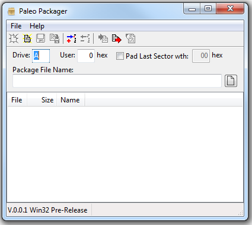
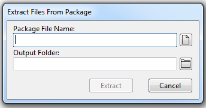

# Paleo Packager
…inspired by Grant Searle's *Binary to CPM Package* utility.

The *Paleo Packager* utility is used to prepare Package files suitable to be uploaded to CP/M computers using [Grant Searle](http://searle.x10host.com/)'s [`DOWNLOAD.COM`](http://searle.x10host.com/cpm/index.html#InstallingApplications) utility. The *Paleo Packager* is comparable to Grant Searle's *Binary to CPM Package (by G. Searle) v1.1* \[[FilePackage.exe](http://searle.x10host.com/cpm/z80sbcFiles.zip)\] utility for it's general purpose, but includes additional features.

The *Paleo Packager* allows you to add the files to be included in a Package file by either adding them through the ***File* | *Add…*** menu option, pressing the **Ctrl+Ins** shortcut or the files can be dragged onto the utility from Windows Explorer. Files can be removed by selecting each file in the list and either selecting the ***File* | *Delete…*** menu option or pressing the **Ctrl+Del** shortcut. The order of the files can be sorted by dragging the files in the list with the mouse. 

Various options can also be specified in several fields. The drive that the `DOWNLOAD.COM` utility resided on the CP/M computer can be selected in the *Drive:* field. The CP/M user number into which the file should be uploaded to can be specified in the *User:* field by hexadecimal value. The user can decide if the uploaded file's last sector should be padded out to 128 character; and if so, which character (hexadecimal value) should be used to pad the sector in the *Pad Last Sector with:* checkbox and field.

Finally, the file name and location of the Package file (.pkg) that will be generated is specified in the *Package File Name:* field.

Once all of the files have been collected in the list and the various fields have been set, the *Paleo Packager* file (.ppf) can be saved to disk. This allows the *Paleo Packager* file to be used to to generating a Package file with these files and field values in the future.

The Package file is generated by selecting the ***File* | *Generate*** menu option or pressing the **Ctrl+G** shortcut. After generation, the Package file can be views by selecting the ***File* | *Review…*** menu option or pressing the **Ctrl+R** shortcut.

The *Paleo Packager* utility also can extract the files from a Package file. Selecting the ***File* | *Extract…*** menu option or pressing the **Ctrl+E** shortcut brings up the *Extract Files From Package* dialog:

Select the Package file in the *Package File Name:* field and select the folder to extract the files into in the *Output Folder:* field. Clicking the *Extract* button will extract all of the files from the specified Package file into the specified folder. Click the *Cancel* button will abandon the attempt and close the dialog.

## Features

The *Paleo Packager*'s main improvement allows the list of files and other aspects of the Package file to be saved and reused again in the future. This is handy when development is in progress and multiple revisions of the Package file need to be generated for the same set of files over time.

The name and location of the Package file can be specified.

Various parameters can be specified:
* The drive location of the `DOWNLOAD.COM` file on the destination CP/M computer.
* The User space that the files will be extracted to on the destination CP/M computer.
* The fill character and the choice to fill the last sector up to 128 characters of extracted files.

The order of the files can be sorted.

The generated Package files can be reviewed.

Files from a Package file can be extracted.

## Known Issues

TBD

## Missing Features

* Online Help
* User Documentation
* Check for Updates

## Installation

[Windows installers](https://github.com/alloidian/PaleoPackager/releases) are provided to install 32- or 64-bit Microsoft Windows version of the *Paleo Packager*.

The *Paleo Packager* can be installed for all users (which requires elevated access during installation) or only for the current user. Both the 32- and 64-bit version of *Paleo Packager* may be installed side-by-side only on a 64-bit version of Windows and only for all users. (I can't think of a reason why both versions should be installed.)

The installers require Microsoft Windows Vista or later. 

## Building Instructions

The *Paleo Packager* project has only been designed to run on 32- and 64-bit versions of Microsoft Windows. At this time, there has been no effort to port the project to any other operating systems.

The *Paleo Packager* project was developed with the Microsoft Windows 64-bit version of the Lazarus IDE, version 2.2.2 (dated 2022-07-10) and compiled with the Free Pascal Compiler (FPC) version 3.2.2.

In order to work with and compile the project, these tools need to be installed onto your computer. Note: compiling this project on platforms other than Microsoft Windows (i.e., Linux or Macintosh) has not been tested.

The Lazarus IDE (along with the Free Pascal Compiler) can be founded at [SourceForce](https://sourceforge.net/projects/lazarus/).

Windows-based setup installers scripts have been prepared for Inno Setup by [JRSoftware](https://jrsoftware.org/isdl.php).

This compiler must be installed onto your Windows-based computer in order to build the Setup installer for both 32- and 64-bit version of the *Paleo Packager*.

